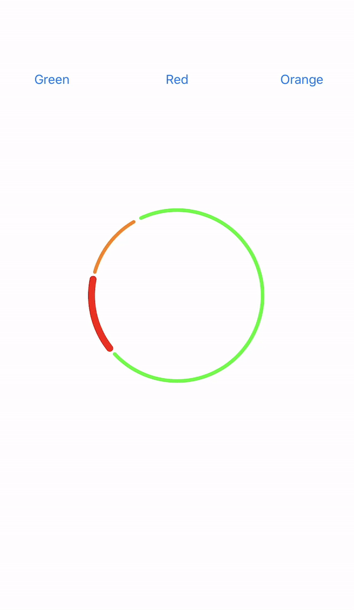

## BudgetChartView

BudgetChartView is a donut chart for general purpose. Selacted angle of chart seems bold for distinguish it from other angles.

[](https://swift.org/package-manager/)

## Demo
<p align="center">
  
</p>

## Requirements
* iOS 10.0+
* Xcode 11+
* Swift 5.2+


## Installation
BudgetChartView is distributed with [Swift Package Manager](https://swift.org/package-manager/) which is the only official distribution tool by Apple. You can add BudgetChartView to your project from Xcode's `File > Swift Packages > Add Package Dependency` menu with its github URL:
```
https://github.com/mobven/BudgetChartView.git
```

## Usage

BudgetChartView can initialize from storyboard or programmatically. You need to feed chart via  `piesSlices` parameter of type `[Slice]`. `Slice` is a struct that contains `percentage` and `color` of each pie slice. 

### Supported Attributes

- piesSlices                         -> Feeding chart data.          ([Slice])
- selectedIndex                   -> Selected index of chart for specify selected angle.      (Int)
- pieSpace                           -> Distance between pie slices             (Double)
- sliceLineWidth                  -> Unselected slice width.          (CGFloat)
- selectedSliceLineWidth    -> Selected slice width.           (CGFloat)

### Programmatically Initialize

``` swift

    let pieDataToDisplay = [Slice(color: .green, percentage: 73),
                                 Slice(color: .red, percentage: 15),
                                 Slice(color: .orange, percentage: 12)]

    let chartView = BudgetChartView(frame: CGRect(x: 0, y: 0, width: 200, height: 200))
    chartView.center = self.view.center
    chartView.piesSlices = pieDataToDisplay
    self.view.addSubview(chartView)
```

### Storyboard Initialization

- Create a view from storyboard.
- Select view and set custom class in the identity inspector with `BudgetChartView`.
- Can set @IBInspactable params in attribute inspector.
- Create an outlet and set attributes for BudgetChartView instance.


## What's next
- [ ] Unit Tests.

---
Developed with 🖤 at [Mobven](https://mobven.com/)
